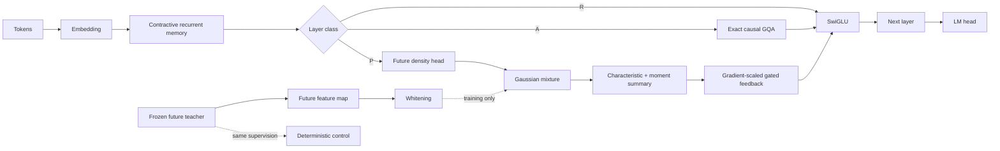

<div align="center">

# AELIA

### Adaptive Ellipsoidal Latent Inference Architecture

**Structured conditional future-density modeling for autoregressive language models**


</div>

AELIA is an autoregressive language-model architecture in which selected causal hidden states parameterize a conditional probability law over stable, observable, finite-horizon future features. That probability law is trained with proper conditional-density objectives, summarized through distribution-invariant characteristic features and low-order moments, then reused by downstream residual computation through a bounded gated feedback path.

The repository contains a mathematically faithful PyTorch reference implementation of the core operators, a complete technical specification, controlled baselines, tests for the main invariants, reproducible experiment configs, and the evaluation protocol required to decide whether the probabilistic structure earns its cost.

> **Research status:** this repository is a transparent reference implementation for architecture research. It prioritizes mathematical correctness, falsifiability, and auditability over fused kernels or production-scale throughput.

## Why AELIA

Standard autoregressive training asks a hidden state to support the next-token distribution. Multi-token prediction adds direct supervision for several future tokens. AELIA adds a different constraint: selected hidden states must also parameterize a coherent conditional distribution over a stable continuous representation of future trajectories.

The core loop is:

```text
causal hidden state h_t
        |
        v
conditional future density q(Z | h_t)
        |
        v
distribution-invariant summary B(q)
        |
        v
bounded gated residual correction
        |
        v
downstream autoregressive computation
```

The central statistical target is a teacher-induced pushforward law over future features:

```text
Y_t+ ~ P_teacher(. | y_<=t)
Z_t  = F_teacher(y_<=t, Y_t+)
P_tF = Law(Z_t | y_<=t)
```

AELIA learns:

```text
q_phi(Z | h_t)
  = sum over m=1..K of
    pi_t,m * Normal(Z ; mu_t,m, Sigma_t,m)
```

with:

```text
Sigma_t,m
  = Diag(sigma_t,m^2)
    + U_t,m U_t,m^T
```

The first-stage experiment uses diagonal covariance. Low-rank covariance is intentionally gated behind evidence that the simpler model helps.

## Architecture



A model stack is composed from three layer classes:

| Class | Sequence operator | Predictive density | Persistent inference state |
|---|---|---:|---|
| `R` | Contractive delta-rule associative memory | No | Fixed-size recurrent state |
| `P` | Contractive recurrent memory | Yes | Fixed-size recurrent state |
| `A` | Exact grouped-query causal attention | No | KV cache grows with context |

A typical pattern is sparse predictive and exact-attention insertion among recurrent layers, for example:

```text
R R R P A  R R R P A  R R R P A  R P
```

## Mathematical core

### 1. Contractive associative memory

The recurrent memory uses a decay-plus-delta update:

```text
S_bar_t = D_t S_(t-1)
v_old,t = S_bar_t^T k_t
e_t     = v_target,t - v_old,t
S_t     = S_bar_t + beta_t k_t e_t^T
```

with normalized keys, `0 <= beta_t <= 1`, and a channelwise decay bounded by:

```text
0 < alpha_t,j <= alpha_max < 1
```

The memory operator therefore satisfies:

```text
||(I - beta_t k_t k_t^T) D_t||_2 <= alpha_max < 1
```

which gives a direct recurrent-state bound when write targets are bounded.

### 2. Stable future-feature law

A frozen teacher and frozen future coordinate system define the distribution AELIA predicts. Target geometry can combine:

- semantic token coordinates;
- Hellinger CountSketch features of teacher output distributions;
- entropy, margin, and realized surprisal;
- multiscale horizon grouping;
- shrinkage whitening fitted on a calibration set.

The target coordinate system remains fixed while the density model is trained.

### 3. Proper mixture likelihood

For each component:

```text
ell_m = log(pi_m) + log Normal(Z ; mu_m, Sigma_m)
```

and the normalized predictive loss is:

```text
L_pred = -(1 / D_z) * logsumexp_m(ell_m)
```

Posterior responsibilities are:

```text
r_m = softmax_m(ell)
```

The implementation contains diagonal and diagonal-plus-low-rank paths using the
Woodbury identity and matrix determinant lemma. A sum-of-squares Mahalanobis form,
log-space routing, and FP32 or FP64 probability arithmetic preserve numerical
stability. Boolean observation masks evaluate exact Gaussian marginals when only
part of a future target is available.

### 4. Distribution-invariant feedback

Mixture labels are arbitrary. AELIA therefore feeds back a representation of the probability distribution, not raw component identities.

For fixed frequency vectors `omega_j`:

```text
phi_q(omega_j)
  = sum_m pi_m
      * exp(i * omega_j^T mu_m
            - 0.5 * omega_j^T Sigma_m omega_j)
```

The residual summary concatenates real and imaginary characteristic values with compressed first and second moments. It is invariant to mode permutation and to splitting a component into identical weighted copies.

### 5. Controlled feedback

```text
h'_t
  = h_t
    + gamma_l
      * gate_t
      * W_pred
      * RMSNorm(B(q))
```

The maximum per-layer strength is depth-scaled. A custom gradient-scale operator lets the density head receive zero or weak LM-gradient feedback while preserving the same forward computation.

## The decisive control

AELIA is not evaluated against a weak extra MLP. The principal deterministic control receives the same future supervision and predicts the same teacher distribution embedding directly:

```text
h_t -> deterministic network -> B_hat_t
```

trained with:

```text
L_embed = mean_squared_error(B_hat_t, B_teacher)
```

It receives the same:

- teacher;
- branch continuations;
- target dimensionality;
- residual insertion points;
- feedback bandwidth;
- parameter envelope;
- measured all-in training FLOPs.

The key experiment is therefore whether learning a coherent conditional density and then embedding it outperforms direct deterministic prediction of the same future-distribution representation.

## Repository map

| Location | Contents |
|---|---|
| `src/aelia/` | Hybrid model, state caches, probability operators, feedback, targets and scoring |
| `tests/` | Dense numerical references, gradient checks, causality and cache equivalence |
| `docs/SPECIFICATION.md` | Architecture and training specification |
| `docs/EXECUTION_MATH.md` | Implemented equations, proofs, precision and complexity |
| `docs/MATHEMATICAL_INVARIANTS.md` | Operator contracts |
| `docs/PERFORMANCE.md` | Measured execution results and reproduction instructions |
| `docs/benchmarks/` | Machine-readable benchmark results |
| `docs/EXPERIMENTS.md` | Controlled research evaluation |
| `configs/` | First-stage and second-stage experiment settings |
| `examples/` | Forward pass, predictive loss and cached decoding |
| `scripts/` | Repository checks, memory estimates and execution benchmarks |

## Quick start

### Install

```bash
git clone <your-repository-url>
cd AELIA
python -m venv .venv
source .venv/bin/activate
pip install -e ".[dev]"
```

On Windows PowerShell:

```powershell
.venv\Scripts\Activate.ps1
pip install -e ".[dev]"
```

### Run the test suite

```bash
pytest -q
```

or:

```bash
make test
```

### Run a minimal forward pass

```bash
python examples/minimal_forward.py
```

### Evaluate the predictive density

```bash
python examples/predictive_loss.py
```

### Run cached decoding and benchmarks

```bash
python examples/cached_decode.py
python scripts/benchmark.py
python scripts/benchmark_recurrent.py
```

## Minimal Python example

```python
import torch
from aelia import AELIALM, ModelConfig

config = ModelConfig(
    vocab_size=32000,
    d_model=256,
    layers=("R", "R", "P", "A", "R", "P"),
    memory_heads=4,
    memory_d_key=32,
    memory_d_value=32,
    attention_query_heads=4,
    attention_kv_heads=2,
    attention_head_dim=64,
    target_dim=64,
    modes=4,
    characteristic_features=24,
)

model = AELIALM(config)
tokens = torch.randint(0, config.vocab_size, (2, 128))
out = model(tokens)

print(out.logits.shape)
print(len(out.predictive))
print(out.predictive[0].params.means.shape)
```

## Cached generation and packed documents

Prefill once, then carry both state lists into each continuation:

```python
model.eval()
with torch.inference_mode():
    out = model(tokens, use_cache=True, logits_to_keep=1, return_predictive=False)
    next_token = out.logits[:, -1].argmax(-1, keepdim=True)
    out = model(
        next_token,
        recurrent_states=out.recurrent_states,
        attention_states=out.attention_states,
        use_cache=True,
        logits_to_keep=1,
        return_predictive=False,
    )
```

`reset_mask[b, t] = True` begins a document before token `t` at every layer.
Attention excludes earlier documents and rotary positions restart at zero.
The cache retains grouped K/V heads and supports single-token or multi-token
chunks. `logits_to_keep=1` projects only the final hidden state to the vocabulary.
`return_predictive=False` omits returned diagnostics while retaining predictive
feedback in the model computation.

On the recorded CPU workload, batched recurrent projections execute 5.97x faster
than token-by-token calls, recurrent forward/backward executes 3.95x faster, and
cached decoding including prefill executes 5.69x faster than full-prefix
recomputation. [Benchmark conditions and raw results](docs/PERFORMANCE.md) specify
the tested shapes, timing dispersion, numerical errors and scope.

## Training sequence

AELIA is deliberately staged so that each additional mechanism must justify itself.

| Gate | Experiment | Required result |
|---:|---|---|
| 1 | Hybrid backbone vs competitive reference | Backbone is viable before predictive machinery |
| 2 | Hybrid + MTP | Direct future supervision has a measured baseline |
| 3 | Stable future-feature supervision | Future target adds value beyond MTP |
| 4 | `K=1` vs `K>1` | Explicit multimodality improves held-out density or LM quality |
| 5 | Density model vs same-supervision deterministic control | Probability structure itself adds value |
| 6 | Feedback vs no feedback | Reusing the predicted distribution improves LM quality |
| 7 | Diagonal vs low-rank covariance | Correlated uncertainty earns its FLOPs |
| 8 | Dense vs sparse modes | Sparse routing improves quality per compute |
| 9 | Always-on vs adaptive predictive compute | Routing improves quality per inference FLOP |

See [`docs/EXPERIMENTS.md`](docs/EXPERIMENTS.md) for the complete protocol.

## Required measurements

AELIA is evaluated on both language-model quality and the quality of its internal predictive law.

**Language modeling**

- validation cross entropy;
- perplexity;
- training FLOPs per token;
- throughput and accelerator utilization;
- prefill and decode throughput;
- persistent memory per sequence and per context token.

**Predictive distribution**

- held-out predictive NLL;
- characteristic-kernel score;
- energy and variogram scores;
- projected PIT and low-dimensional Rosenblatt calibration;
- total, within-mode, and between-mode dispersion;
- posterior-prior KL;
- distinguishable mode information;
- branch continuation-to-mode mutual information;
- active mode count and statistical effective mode count.

**Routing**

- real suffix-model counterfactual utility;
- utility-prediction correlation;
- FLOP budget error;
- counterfactual regret;
- quality gain per predictive FLOP.

## Reference implementation boundaries

Implemented and tested here:

- contractive delta-rule recurrent memory;
- batched recurrent projections with exact state and gradient semantics;
- grouped-query causal attention with document-local RoPE and K/V caches;
- packed-document isolation across recurrent, predictive and attention layers;
- SwiGLU residual blocks;
- diagonal Gaussian-mixture prediction;
- diagonal-plus-low-rank Gaussian likelihood;
- Woodbury inverse and determinant path;
- posterior responsibilities;
- exact log-space mixture routing and partially observed Gaussian marginals;
- characteristic-function embedding;
- covariance-aware projected moments;
- gradient-scaled predictive feedback;
- Hellinger CountSketch;
- multiscale future-observation projection;
- frozen shrinkage whitening;
- same-supervision deterministic control;
- multi-token prediction transform;
- adaptive-compute utility and FLOP-dual primitives;
- projected PIT, energy, variogram, and characteristic-kernel scoring;
- branch mutual-information diagnostics;
- invariant and numerical tests.

Research-scale systems work still required for large models:

- fused recurrent scan kernels;
- tensor/sequence/context parallelism;
- distributed teacher-target generation;
- cached branch-continuation pipeline;
- FP8 kernel validation;
- distributed whitening calibration;
- optimizer-state sharding and checkpoint orchestration;
- end-to-end large-scale training harness.

The detailed status is tracked in [`docs/IMPLEMENTATION_STATUS.md`](docs/IMPLEMENTATION_STATUS.md).

## Design principles

1. **Causality is structural.** Every inference-time predictive quantity is a function of the current causal state.
2. **The probability law has a fixed target geometry.** Teacher and whitening coordinates remain stable during a density stage.
3. **Distributional feedback ignores arbitrary mode labels.** Characteristic features and moments represent the law itself.
4. **Controls receive the same supervision.** Future information is not a hidden advantage of the probabilistic arm.
5. **Compute is measured all-in.** Teacher passes, branch generation, MTP heads, density evaluation, and routing supervision count.
6. **Complexity is conditional on evidence.** Low-rank covariance, sparse modes, and adaptive routing enter only after simpler variants pass their gates.
7. **Every major claim is falsifiable.** A mechanism remains only when a matched experiment shows a statistically meaningful gain.

## Testing philosophy

The test suite checks more than tensor shapes. It validates properties that the architecture depends on:

- document resets isolate every layer;
- cached and full-prefix logits agree;
- batched and tokenwise recurrent outputs, states and gradients agree;
- mixture weights and responsibilities normalize;
- the Woodbury likelihood matches dense Gaussian evaluation;
- partial-target likelihoods and gradients match dense Gaussian marginals;
- degenerate low-rank orientations have finite gradients;
- probability arithmetic preserves FP32 and FP64 precision;
- characteristic feedback is invariant to mode permutation;
- identical-component splitting leaves the characteristic representation unchanged;
- zero feedback-gradient scale prevents LM feedback from modifying density parameters;
- whitening remains finite and centered;
- the reference hybrid model executes end to end.

Run all repository checks with:

```bash
python scripts/check_repo.py
```

## Configuration

Two research configs are provided:

- [`configs/first_stage.yaml`](configs/first_stage.yaml): the smallest decisive experiment, diagonal covariance, dense modes, always-on predictive computation, zero LM gradient into the density head.
- [`configs/second_stage.yaml`](configs/second_stage.yaml): a larger conditional experiment with low-rank covariance and optional sparse/adaptive mechanisms.

The YAML files describe experimental intent. The `ModelConfig` dataclass is the executable configuration for the reference core.

## Documentation

- **[Full mathematical and systems specification](docs/SPECIFICATION.md)**
- **[Mathematical invariants](docs/MATHEMATICAL_INVARIANTS.md)**
- **[Execution mathematics](docs/EXECUTION_MATH.md)**
- **[Performance measurements](docs/PERFORMANCE.md)**
- **[Experimental protocol](docs/EXPERIMENTS.md)**
- **[Implementation status](docs/IMPLEMENTATION_STATUS.md)**

## Citation

If you build on the architecture or reference implementation, use the included [`CITATION.cff`](CITATION.cff) metadata and identify the exact commit and experiment configuration used.

## License

Apache License 2.0. See [`LICENSE`](LICENSE).
